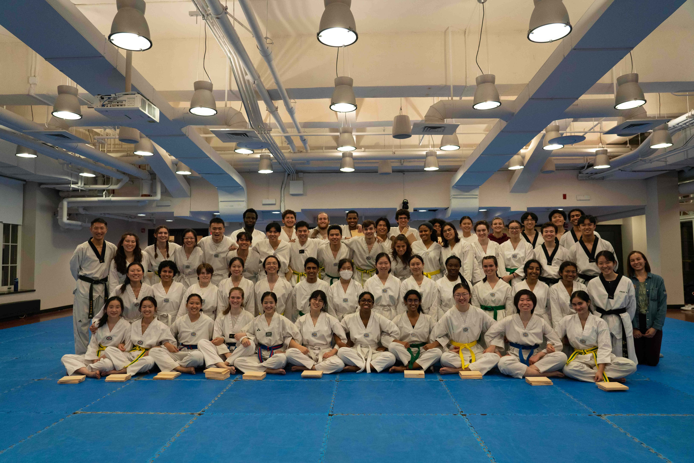
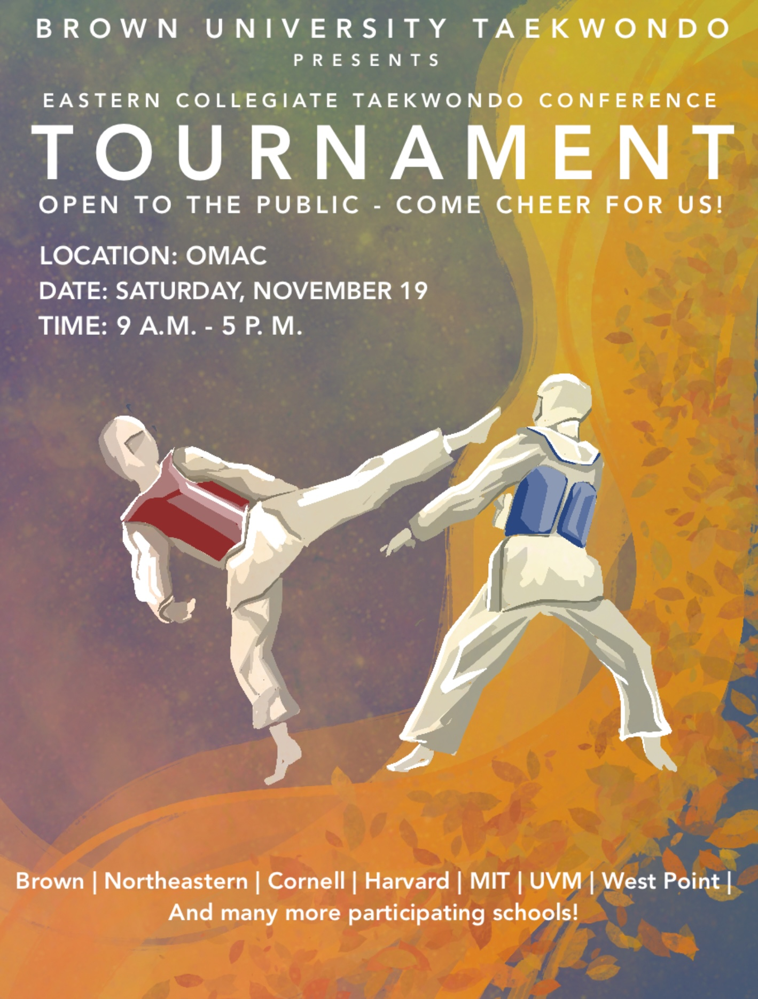

# Fall 2022 Promotional Testing

## 12/15/2022

##### 
Another year under our belts! We had 46 students complete their promotion tests. Excellent job to all! Happy holidays, and see you all next semester!

___

# Brown Taekwondo Secures SECOND Place in Divison 1 at Home Tournament

## 11/29/2022

##### 
48 of our members competed at our home tournament on November 19th, 2022. Amazing job done by everyone!

Results:

In Poomsae(P):\
A Team (Black Belt) Division\
Quarterfinals:\
PA2 - Dylan L ‘25, Aman S ‘26, Jiwon Y ‘26\
Round of 16:\
PA1 - Angela B ‘24, Owen L ‘25, Ivan S ‘25\
Round of 64:\
PA3 - Austin P ‘24, Lucy Z Grad\
PA4 - Stephanie S ‘26, Charlotte S ‘26

B Team (Blue and Red Belt) Division\
Silver:\
PB1 - Carolyn L ‘23, Stella N ‘23, Lauren P ‘23\
Round of 32:\
PB2 - Edward S ‘26

C Team (White to Green Belt) Division\
Gold:\
PC1 - Saipravallika C ‘24, Jennifer L ‘25, Efia A ‘25\
Bronze:\
PC2 - Athina C ‘26, Benjamin G ‘24, Jennifer C ‘24\
Round of 16:\
PC3 - Sid U ‘26, Andrey A ‘24, Ibrahim N ‘23\
PC5 - Nijpawi G ‘25, Kyle L ‘25, Elise P ‘25\
Round of 32:\
PC6 - Joanne L ‘24, Jared O ‘25, Julia M ‘26\
PC7 - Jiwoo S Grad, Luis O ‘26, Erin W ‘26\
Round of 64:\
PC4 - Rebecca C ‘26, Johanna L ‘26, Aidin M ‘26\
PC8 - Morgane P ‘26, Daniela Ponce C ‘25, Min N ‘24\
PC9 - Jesus R ‘26, Nancy Z ‘26, Evelyn L ‘24\
PC10 - Chinmayi R ‘26, Kaley N ‘26, Caterina D ‘24\
PC12 - Shyenne S ‘25, Icy L ‘25\
Round of 128:\
PC11 - Avery M ‘26, Wei Yang C ‘26

In Women’s Sparring:\
A Team\
A1 - Angela B ‘24 - Round of 32\

B Team\
B1 - Carolyn L ‘23, Lauren P ‘23, Stella N ‘23 - Bronze

C Team\
Gold:\
C1 - Saipravallika C ‘24, Jennifer L ‘25, Efia A ‘25\
Bronze:\
C3 - Rebecca C ‘26, Elise P ‘25, Icy L ‘25\
Round of 16:\
C4 - Nijpawi G ‘25, Erin W ‘26, Shyenne S ‘25\
C6 - Morgane P ‘26, Kaley N ‘26\
Round of 32:\
C2 - Jennifer C ‘24, Johanna L ‘26, Joanne L ‘24\
C5 - Julia M ‘26, Caterina D ‘24\
C7 - Evelyn L ‘24, Daniela Ponce C ‘25\
C8 - Chinmayi R ‘26, Min N ‘24\
Round of 64:\
C9 - Nancy Z ‘26

In Men’s Sparring:\
A Team\
Quarterfinals:\
A1 - Dylan L ‘25, Austin P ‘24\
Round of 32:\
A2 - Ivan S ‘25\
A3 - Owen L ‘25\
A4 - Aman S ‘26

B Team\
Round of 16:\
B1 - Edward S ‘26

C Team\
Silver:\
C1 - Kyle L ‘25, Andrey A ‘24, Ibrahim N ‘23\
Bronze:\
C2 - Sid U ‘26, Jiwoo S Grad - Bronze, Aidin M ‘26\
Round of 16:\
C3 - Jared O ‘25, Luis O ‘26\
C4 - Jesus R ‘26, Wei Yang C ‘26
___

# Brown Taekwondo Presents ECTC Tournament

## 11/17/22

##### 
ITS HAPPENING! We're hosting another ECTC Tournament, and we're all so excited to see you there! Come out to the OMAC and cheer us on!
___

# Brown Taekwondo Returns to Cornell Tournament

## 11/9/2022

##### 
29 Competitors from Brown attended Cornell for an Eastern Collegiate Taekwondo Conference (ECTC) Tournament on November 6th, 2022. Amazing job, everyone!

In Poomsae (P):\
A Team (Black Belt) Division\
PA1 - Angela Baek ‘24, Owen Lockwood ‘25, Ivan Sung ‘25 - Round of 32\
PA2 - Dylan Lee ‘25, Jiwon Yoo '26 - Round of 64

B Team (Blue and Red Belt) Division\
PB1 - Carolyn Lai ‘23, Lauren Paradise ‘23, Stella Ng ‘23 - Bronze

C Team (White to Green Belt) Division\
PC1 - Saipravallika Chamarthi ‘24, Efia Awuah ‘25, Jennifer Li ‘25 - Gold\
PC2 - Athina Chen ‘26, Benjamin Goff ‘24, Jennifer Cheng ‘24 - Bronze\
PC3 - Kyle Lam ‘25, Ibrahim Ndiaye ‘23, Andrey Arshava ‘24 - Round of 32\
PC4 - Johanna Leang ‘26, Rebecca Chou ‘26, Aidin Moldosanov ‘26 - Round of 16\
PC5 - Morgane Pizigo ‘26, Erin Williams ‘26, Min Namgung ‘24 - Quarterfinals\
PC6 - Cole Maisonpierre Grad/Med, Jared Ong ‘25, Avery Maytin ‘26 - Round of 64\
PC7 - Daniela Ponce ‘26, Julia Moon ‘26, Luis Ocampo ‘26 - Round of 64

In Women’s Sparring:\
B Team (Blue and Red Belt) Division\
WB1 - Carolyn Lai ‘23, Lauren Paradise ‘23, Stella Ng ‘23 - Round of 16

C Team (White to Green Belt) Division\
WC1 - Saipravallika Chamarthi ‘24, Jennifer Li ‘25, Efia Awuah ‘25 - Silver\
WC2 - Morgane Pizigo ‘26, Johanna Leang ‘26 - Round of 16\
WC3 - Jennifer Cheng ‘24, Erin Williams ‘26 - Round of 16\
WC4 - Julia Moon ‘26, Min Namgung ‘24 - Round of 32\
WC5 - Daniela Ponce ‘26 - Round of 32

In Men’s Sparring:\
A Team (Black Belt) Division\
MA1 - Ivan Sung ‘25 - Round of 32\
MA2 - Owen Lockwood ‘25 - Round of 32

C Team (White to Green Belt) Division\
MC1 - Kyle Lam ‘25, Andrey Arshava ‘24, Ibrahim Ndiaye ‘25 - Silver\
MC2 - Jared Ong ‘25, Luis Ocampo ‘26, Aidin Moldosanov ‘26 - Round of 16\
MC3 - Avery Maytin ‘26, Cole Maisonpierre Grad/Med - Round of 32